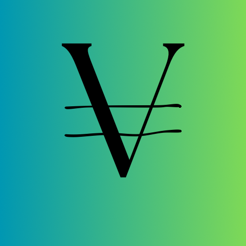

<div align="center">
    
</div>

# Vincoin website
This repository contains source code for `Vincoin` website. Website is written in `TypeScript` with `SvelteKit` framework.

Live preview is available at: [vincoin.world](https://vincoin.world)

## Installation
To install the website locally, first make sure that you have [`bun`](https://bun.sh/) installed.  
Then proceed with installing the dependencies, by typing:  
```bash
bun install
```

To get a development version, run:

```bash
bun run dev
```

To create a **production** version of website run:

```bash
bun run build
```

You can preview the production build by running `npm run preview`.
  
----
**PGPs:**  
`5BC7030 EA0380EA 4BB8A470 E9F4475B 4CF37D56A`  
`6302D860 B74CBD34 6482DBA2 518766D0 8213DBC0`  


<div align="center">
    <a href="https://stackexchange.com/users/215166">
        
    </a>
    <p>Copyright © 2023 <a href="https://github.com/vexy">Vexy</a><p>
</div>

